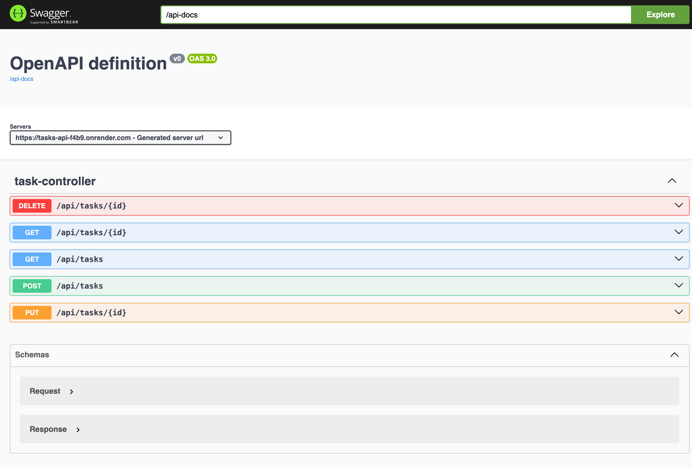
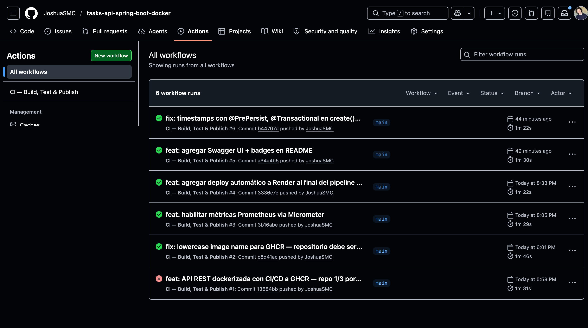

# 🐳 tasks-api


API REST de gestión de tareas construida con **Java 21 + Spring Boot 3**, dockerizada con multi-stage build y publicada en GHCR mediante un pipeline CI/CD con GitHub Actions.

> **Repo 1 de 3 — Portfolio DevOps/Cloud**
> Este repo es la aplicación base. El deploy automatizado y el monitoreo se encuentran en [`devops-pipeline-github-actions-grafana`](https://github.com/JoshuaSMC/devops-pipeline-github-actions-grafana).

> 🟢 **Live:** https://tasks-api-f4b9.onrender.com/api/tasks
> 📄 **Swagger UI:** https://tasks-api-f4b9.onrender.com/swagger-ui.html

---

## ⚙️ Tecnologías

| Capa | Tecnología |
|------|-----------|
| Lenguaje | Java 21 |
| Framework | Spring Boot 3.2 |
| Persistencia | Spring Data JPA + H2 (in-memory) |
| Validación | Jakarta Validation |
| Observabilidad | Spring Actuator + Micrometer (Prometheus) |
| Contenedor | Docker (multi-stage build) |
| Registry | GHCR (GitHub Container Registry) |
| CI/CD | GitHub Actions |

---

## 🗺️ Narrativa del portfolio

Este proyecto forma parte de una trilogía que cubre el flujo DevOps completo:

| Repo | Qué muestra |
|------|------------|
| **1. tasks-api** ← estás acá | App dockerizada, publicada en GHCR con CI/CD |
| [2. infrastructure-as-code-terraform-aws](https://github.com/JoshuaSMC/infrastructure-as-code-terraform-aws) | Infraestructura como código con Terraform y CloudFormation |
| [3. devops-pipeline-github-actions-grafana](https://github.com/JoshuaSMC/devops-pipeline-github-actions-grafana) | Pipeline CI/CD completo: deploy automático + monitoreo con Grafana |

---

## 🏗️ Arquitectura del pipeline

```
┌─────────────────────────────────────────────────────┐
│                   GitHub Actions                     │
│  push → build → test → docker build → smoke test    │
│                                     → push a GHCR   │
└─────────────────────┬───────────────────────────────┘
                      │ imagen publicada
                      ▼
              ┌───────────────┐
              │     GHCR      │
              │  ghcr.io/...  │
              └───────┬───────┘
                      │ deploy automático
                      │ (ver repo 3)
                      ▼
              ┌───────────────┐
              │   Producción  │
              │  tasks-api    │
              │  :8080        │
              └───────────────┘
```

---

## 🌐 Probalo sin clonar

La API está desplegada en Render. Podés probarla directamente:

```bash
# Health check
curl https://tasks-api-f4b9.onrender.com/actuator/health

# Listar tareas
curl https://tasks-api-f4b9.onrender.com/api/tasks

# Crear una tarea
curl -X POST https://tasks-api-f4b9.onrender.com/api/tasks \
  -H "Content-Type: application/json" \
  -d '{"title": "Mi tarea", "description": "Descripción"}'
```

> O explorá la API visualmente en el **[Swagger UI](https://tasks-api-f4b9.onrender.com/swagger-ui.html)** ← sin instalar nada



---

## 🚀 Instalación local

### 🧩 Requisitos previos
- Java 21+
- Maven 3.8+
- Docker Desktop

### 📦 Clonar el repositorio
```bash
git clone https://github.com/JoshuaSMC/tasks-api-spring-boot-docker.git
cd tasks-api-spring-boot-docker
```

---

### 🐳 Con Docker (recomendado)

```bash
docker compose up --build
```

> La API estará disponible en `http://localhost:8080`

---

### ☕ Sin Docker

```bash
# Correr la API
mvn spring-boot:run

# Con H2 Console habilitada (http://localhost:8080/h2-console)
mvn spring-boot:run -Dspring.profiles.active=dev
```

> La API estará disponible en `http://localhost:8080`

---

## 📬 Endpoints (API REST)

| Método | Endpoint | Descripción |
|--------|----------|-------------|
| `GET` | `/api/tasks` | Listar todas las tareas |
| `GET` | `/api/tasks?status=PENDING` | Filtrar por estado |
| `GET` | `/api/tasks/{id}` | Obtener tarea por ID |
| `POST` | `/api/tasks` | Crear nueva tarea |
| `PUT` | `/api/tasks/{id}` | Actualizar tarea |
| `DELETE` | `/api/tasks/{id}` | Eliminar tarea |
| `GET` | `/actuator/health` | Health check del contenedor |
| `GET` | `/actuator/prometheus` | Métricas para Prometheus/Grafana |
| `GET` | `/swagger-ui.html` | Documentación interactiva de la API |

### Estados posibles

`PENDING` → `IN_PROGRESS` → `DONE`

### Ejemplo de uso

```bash
# Crear una tarea
curl -X POST http://localhost:8080/api/tasks \
  -H "Content-Type: application/json" \
  -d '{"title": "Configurar Terraform", "description": "Crear módulo VPC"}'

# Listar tareas pendientes
curl http://localhost:8080/api/tasks?status=PENDING

# Actualizar estado
curl -X PUT http://localhost:8080/api/tasks/1 \
  -H "Content-Type: application/json" \
  -d '{"title": "Configurar Terraform", "status": "DONE"}'
```

> Los datos se almacenan en H2 in-memory — se resetean al reiniciar el contenedor.

---

## 🧪 Testing

```bash
mvn verify
```

| Suite | Tests | Qué verifica |
|-------|-------|-------------|
| `TaskControllerTest` | 4 | Lista, creación, 404, filtro por estado |
| `TasksApiApplicationTests` | 1 | Carga del contexto de Spring |

**Total: 5 tests — BUILD SUCCESS ✓**

---

## 🔄 CI/CD

El pipeline en `.github/workflows/ci.yml` se ejecuta en cada push a `main` o `develop`:

| Paso | Descripción |
|------|------------|
| Build + test | `mvn verify` — compila y corre los 5 tests |
| Docker build | Construye la imagen multi-stage con `load: true` |
| Smoke test local | Levanta el contenedor y verifica `/actuator/health` con retry y fallo explícito |
| Push a GHCR | Publica `ghcr.io/joshuasmc/tasks-api:latest` (solo en `main`) |
| Deploy a Render | Dispara el deploy hook y verifica `"status":"UP"` con retry de 3 minutos |



---

## 🐋 Dockerfile — decisiones técnicas

- **Multi-stage build**: imagen final solo incluye el JRE, no Maven ni el JDK completo (~180MB vs ~600MB)
- **Eclipse Temurin Alpine**: imagen base mínima y de distribución libre
- **Usuario no-root**: el proceso corre como `appuser`, no como `root`
- **HEALTHCHECK**: Docker monitorea el estado del contenedor automáticamente

---

## 👤 Autor

- [@JoshuaSMC](https://github.com/JoshuaSMC)

---

## 📄 Licencia

MIT
